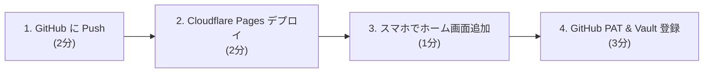

# Cloudflare Pages デプロイ＆初期セットアップ完全ガイド

既存の Cloudflare アカウントがある状態から、本アプリ（`webapp-obsidian`）を Cloudflare Pages にデプロイし、スマホのホーム画面に追加して Obsidian ノートを爆速閲覧・編集し始めるまでの全手順です。

---

## ⏱️ 全体フロー（所要時間: 約8〜10分）



---

## STEP 1: GitHub にアプリ本体をプッシュする (約2分)

ローカルで作った `webapp-obsidian` のコードを GitHub にプッシュします。

### 1. GitHub 上で空リポジトリを作成
- GitHub にアクセスし、**「New repository」** を開く。
- **Repository name**: `webapp-obsidian`
- **Public / Private**: どちらでも構いません（**Private** 推奨）。
- ※ `README` や `.gitignore` の追加チェックは **すべて外した状態（空）** で作成。

### 2. ローカルからプッシュ
ターミナルで以下を実行します（`<your-username>` はご自身の GitHub アカウント名に置き換えてください）：

```bash
cd /Users/s-ikari/work/webapp-obsidian
git remote add origin https://github.com/<your-username>/webapp-obsidian.git
git branch -M main
git push -u origin main
```

---

## STEP 2: Cloudflare Pages にデプロイする (約2分)

Cloudflare は静的 SPA のホスティングが**完全無料・転送量無制限**です。

1. **Cloudflare ダッシュボード** にログイン:
   👉 [https://dash.cloudflare.com/](https://dash.cloudflare.com/)
2. 左メニューの **「Workers & Pages」**（または Compute & Pages）をクリック。
3. **「作成」**（Create application）ボタン ➡ **「Pages」** タブを選択。
4. **「Git に接続」**（Connect to Git）をクリック。
5. GitHub アカウントを連携し、先ほどプッシュした **`webapp-obsidian`** を選択して **「セットアップを開始」** をクリック。
6. **ビルド設定の入力**:
   - **プロジェクト名**: `webapp-obsidian`（自動生成されるURL: `https://webapp-obsidian.pages.dev`）
   - **本番環境ブランチ**: `main`
   - **フレームワークのプリセット**: `Vite`（または `None`）
   - **ビルドコマンド**: `npm run build`
   - **ビルド出力ディレクトリ**: `dist`
   - **ルートディレクトリ**: `/`（空欄のままでOK）
   - ※環境変数の設定は不要です（トークン等は各端末のブラウザ内 localStorage に安全に保存されます）。
7. **「保存してデプロイ」** をクリック。
8. 1〜2分待つとビルドが完了し、**`https://webapp-obsidian-xxxx.pages.dev`** のような公開 URL が発行されます！

> [!TIP]
> リポジトリ直下に配置されている [`wrangler.json`](../wrangler.json) の設定により、SPA のブラウザ更新時でも 404 にならずスムーズに動作します。

---

## STEP 3: スマホでアクセスして「ホーム画面に追加」 (PWA化・約1分)

ブラウザのURLバーやタブを消し、ネイティブアプリ感覚で0.1秒起動できるようにします。

### iPhone (Safari) の場合
1. 発行された Cloudflare Pages の URL を **Safari** で開く。
2. 画面下部中央の **「共有ボタン（四角から上矢印）」** をタップ。
3. メニューを下にスクロールし、**「ホーム画面に追加」** をタップ。
4. 名前（例: `Obsidian Web`）を確認して右上の **「追加」** をタップ。
5. ホーム画面に紫色の Obsidian アイコンが追加されます。以降はここをタップするだけで全画面で爆速起動します。

### Android (Chrome) の場合
1. 発行された URL を **Chrome** で開く。
2. 右上のメニュー（︙）をタップ。
3. **「アプリをインストール」** または **「ホーム画面に追加」** をタップ。

---

## STEP 4: GitHub Fine-grained PAT の発行＆Vault登録 (約3分)

スマホから安全にプライベート Vault（Markdown）を読み書きするための設定です。

### 1. GitHub Personal Access Token (PAT) の発行
1. PC またはスマホのブラウザで GitHub の [Personal Access Tokens (Fine-grained)](https://github.com/settings/tokens?type=beta) を開く。
2. **「Generate new token」** をタップ。
3. 入力項目:
   - **Token name**: `webapp-obsidian-mobile`
   - **Expiration**: 任意（最長1年、またはカスタム）
   - **Repository access**: **「Only select repositories」** を選び、対象の Vault リポジトリ（例: `202609_ghibli-park` や `task-management`）を選択。
   - **Permissions** ➡ **Repository permissions**:
     - **Contents**: **`Access: Read and write`** を選択（これだけでOK）。
4. 最下部の **「Generate token」** を押し、生成された `github_pat_xxxx` をコピー。

### 2. アプリでの Vault 登録
1. スマホのホーム画面からアプリを起動。
2. 初期画面の「Vaultを設定する」、または右上の **⚙️ 設定ボタン** をタップ。
3. 以下の情報を入力:
   - **Vault 表示名**: 例 `ジブリパーク旅行計画`（分かりやすい名前でOK）
   - **GitHub Owner**: ご自身の GitHub ユーザー名（例: `hatomachi`）
   - **Repo 名**: Vault のリポジトリ名（例: `202609_ghibli-park`）
   - **Branch**: `main`
   - **GitHub Personal Access Token (PAT)**: 先ほどコピーした `github_pat_xxxx`
4. **「🔌 接続テスト」** をタップ ➡ 緑色で「接続成功」と出ればOK！
5. **「Vaultを追加」** をタップすると、ノート一覧が自動読み込みされます。

---

## STEP 5: （任意・セキュリティ強化）Cloudflare Access で URL を保護する

Cloudflare Pages の無料機能「Zero Trust (Cloudflare Access)」を使えば、**自分のメールアドレス宛に届くワンタイムパスコード（PIN）を知っている人だけがアクセスできる** ように完全防御できます。

1. Cloudflare ダッシュボード ➡ **「Zero Trust」** を開く。
2. **「Access」** ➡ **「Applications」** ➡ **「Add an application」** ➡ **「Self-hosted」** を選択。
3. **Application name**: `Obsidian Web App`
4. **Application domain**: 発行された Pages のドメイン（例: `webapp-obsidian.pages.dev`）
5. **Policies**:
   - Policy name: `Allow My Email`
   - Action: `Allow`
   - Configure a rule: **Include** ➡ **Emails** ➡ ご自身のメールアドレスを入力。
6. 保存すると、URL にアクセスした際にメアド宛てに6桁の確認コードが届く認証画面が自動で挟まるようになります。

---

## 🎉 これで準備完了！

- **外出先・旅行先で**:
  - 電波が圏外になっても、オフラインキャッシュでノート（旅程や持ち物リストなど）を瞬時に閲覧できます。
  - 閲覧画面上の `- [ ]` チェックボックスをタップするだけで、裏で GitHub にコミットされ、PC 側の Obsidian でも後から `git pull` して最新状態を確認できます。
  - 右上のドロップダウンからいつでも別の Vault（個人タスクやアイデアメモ等）に1秒で切り替えられます。
